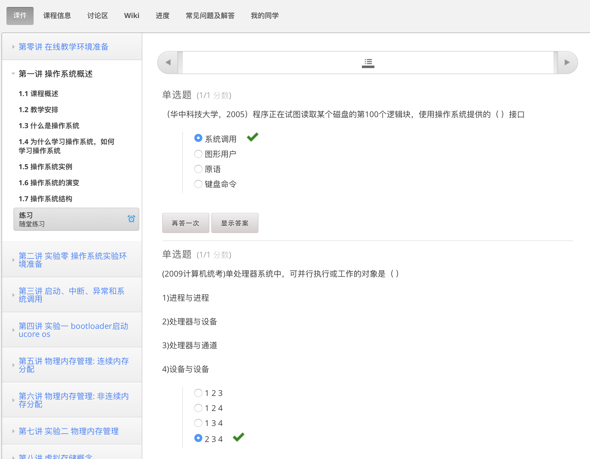

# 课前准备

- 完成lec1的视频学习和提交对应的在线练习
  - 已完成lec1视频学习，并完成相应在线练习，如下图所示；
    
- git pull ucore_os_lab, ucore_os_docs, os_tutorial_lab, os_course_exercises in github repos。这样可以在本机上完成课堂练习。
  - 已将ucore_os_lab, ucore_os_docs, os_tutorial_lab, os_course_exercise fork到本人github代码仓库，并且clone到本机使用；
- 知道OS课程的入口网址，会使用在线视频平台，在线练习/实验平台，在线提问平台(piazza)
- 在piazza上就学习中不理解问题进行提问。
  - 正在尝试使用与熟悉各个平台操作；
- 会使用linux shell命令，如ls, rm, mkdir, cat, less, more, gcc等，也会使用linux系统的基本操作。
  - 能较熟练使用上述linux命令；

# 思考题

## 填空题

* 当前常见的操作系统主要用__C和汇编__编程语言编写。
* "Operating system"这个单词起源于__Operator__。
* 在计算机系统中，控制和管理__资源__、有效地组织__程序__运行的系统软件称作__操作系统__。
* 允许多用户将若干个作业提交给计算机系统集中处理的操作系统称为__批处理__操作系统
* 你了解的当前世界上使用最多的32bit CPU是__IA32 CPU__，其上运行最多的操作系统是__Linux__。
* 应用程序通过__系统调用(System Call)__接口获得操作系统的服务。
* 现代操作系统的特征包括__并发__，__共享__，__虚拟__，__异步__。
* 操作系统内核的架构包括__微内核结构__，__宏内核结构__，__外核结构__。

## 问答题

- 请总结你认为操作系统应该具有的特征有什么？并对其特征进行简要阐述。
  - 答：操作系统应该具有的特征有并发、共享、虚拟和异步，对该四个特征分别阐述如下：
    1. 并发是指在操作系统之中，存在多个正在运行的应用程序；
    2. 共享是指，对于上述中的多个应用程序，在并发运行的时候，宏观上要体现出，其均在同时访问资源，而在微观上则要实现资源的互斥访问；
    3. 对于虚拟，是指对于每一个用户，都应该觉得整个计算机只是专门为该用户提供服务，使得每一个用户均不会受到其他用户对计算机使用的影响；
    4. 异步是指，由于操作系统进行进程调度的缘故，对于单一个应用程序，其运行过程是走走停停的，并且只要用户的输入是一致的，该应用程序的输出结果也应该是一致的。

- 为什么现在的操作系统基本上用C语言来实现？为什么没有人用python，java来实现操作系统？
  - 答：
    - 首先是相对于汇编等较低级的语言而言，C语言作为一种高级语言，具有更高的易用性与可读性，对编写OS提供了便利；并且由于是高级语言，C语言编写的OS也便于移植到其他平台上；
    - 相对于python，java等更加简单的高级语言，C语言具有着性能上的优势；
    - 个人认为，选择C语言作为编写OS的语言，也有种在性能和易用性之间做trade off的意味；
    - C语言也足够底层，比如说其可以很方便的进行汇编代码的内嵌等。
